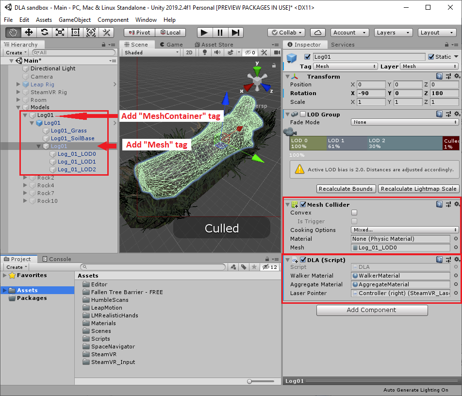

```
TODO: introduction
```

## DLA.cs

```
TODO: describe function
```

## WalkerScript.cs

```
TODO: describe function
```

## Usage

1. Place your mesh object in a GameObject container with the tag `MeshContainer`.
1. Give the mesh object the tag `Mesh`.
1. Attach a `MeshCollider` to the mesh object.
1. Attach the `DLA.cs` script to the mesh object.

